<p align="center">
  <picture>
    <source media="(prefers-color-scheme: dark)" srcset="./dark.svg" />
    <source media="(prefers-color-scheme: light)" srcset="./light.svg" />
    
  </picture>
</p>

<p align="center">
  <a href="https://aayush-mandavia-portfolio.vercel.app" target="_blank">
    
  </a>
  <a href="https://linkedin.com/in/aayush-mandavia" target="_blank">
    
  </a>
  <a href="https://github.com/AayushMandavia" target="_blank">
    
  </a>
</p>

---

### 👨‍💻 About Me

```bash
aayush@terminal:~$ neofetch --profile
```

- 🎓 **Education:** B.Tech in Electronics & Telecommunication Engineering at **Dwarkadas J. Sanghvi College of Engineering**
- 💼 **Experience:** Software Development Intern @ **Infinity Online Solutions**
- 🎯 **Primary Focus:** Full-Stack Web Development, Data Analytics, Machine Learning & Systems
- 💡 **Passion:** Crafting high-performance applications, interactive data dashboards, and clean developer experiences
- 🌐 **Portfolio:** [aayush-mandavia-portfolio.vercel.app](https://aayush-mandavia-portfolio.vercel.app)

---

### 🛠️ Tech Stack & Tooling

```bash
aayush@terminal:~$ ./display_stack.sh --all
```

#### Languages & Core
<p>
  
  
  
  
  
  
  
  
</p>

#### Web Development & Frameworks
<p>
  
  
  
  
  
</p>

#### Databases & Cloud Services
<p>
  
  
  
</p>

#### Data Science, Machine Learning & Analytics
<p>
  
  
  
  
  
</p>

#### Developer Workflow & Design
<p>
  
  
  
  
</p>

---

### 🚀 Featured Engineering Projects

| Project | Description | Stack |
| :--- | :--- | :--- |
| **🍽️ ESTIA** | End-to-end restaurant reservation and digital e-menu web application providing intuitive customer booking and dynamic menus. | React, Node.js, Database, REST API |
| **🎓 Infinity Mentor Theme** | Production-ready custom Moodle LMS theme designed for enhanced e-learning engagement, accessibility, and modern responsive UI. | PHP, JavaScript, CSS/SCSS, Moodle LMS |
| **📊 Data Analysis Projects** | Comprehensive exploratory data analysis (EDA) studies on global Netflix trends, urban traffic congestion patterns, and air pollution metrics. | Python, Pandas, Matplotlib, Power BI |
| **🚗 CV & ML Projects** | Computer vision pipelines featuring real-time multi-class object detection and vehicle lane-tracking algorithms. | Python, OpenCV, Deep Learning, NumPy |
| **💻 Portfolio & Web Apps** | Modern high-performance personal portfolio website, responsive web showcases, and tailored client solutions. | React, Next.js, Vercel, WordPress |

---

### 📈 GitHub Analytics

<p align="center">
  
  
</p>

<p align="center">
  
</p>

---

<h2 align="center">🐍 GitHub Contributions</h2>

<p align="center">
  <picture>
    <source
      media="(prefers-color-scheme: dark)"
      srcset="https://raw.githubusercontent.com/AayushMandavia/AayushMandavia/output/github-snake-dark.svg"
    />
    <source
      media="(prefers-color-scheme: light)"
      srcset="https://raw.githubusercontent.com/AayushMandavia/AayushMandavia/output/github-snake.svg"
    />
    
  </picture>
</p>

> *The contribution snake eats GitHub activity blocks and updates automatically once daily via GitHub Actions.*

---

### 📬 Connect With Me

<p align="center">
  <a href="https://linkedin.com/in/aayush-mandavia" target="_blank">
    
  </a>
  &nbsp;&nbsp;
  <a href="https://aayush-mandavia-portfolio.vercel.app" target="_blank">
    
  </a>
  &nbsp;&nbsp;
  <a href="https://github.com/AayushMandavia" target="_blank">
    
  </a>
</p>

<p align="center">
  <sub>Engineered with precision • Terminal aesthetic • Designed for GitHub</sub>
</p>
